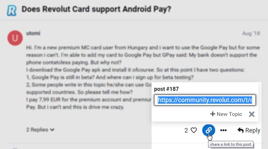
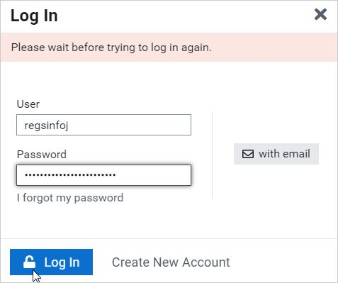

## 1 General Description
Proposed solution is build with use of Java, Selenium, JUnit. Project contains [core](/src/main/java/com/revolut/task/core)
folder and [tests](/src/main/java/com/revolut/task/tests). Use IDE run option to launch automation suite or particular tests.
Page Object Model underlies test base structure.
Proceed to [BaseTestConfigurator.java](/src/main/java/com/revolut/task/tests/BaseTestConfigurator.java) to change webdriver options.
Make sure that English (United States) is installed in the environment where tests are supposed to be run, 
if you want to run them in the headless mode.

## 2 Tasks
#### 2.1 Main Task
1. [HomePageTest.java](src/main/java/com/revolut/task/tests/HomePageTest.java).
2. Tests in [keyboard](src/main/java/com/revolut/task/tests/keyboard) package.
3. [HomePageTest.java](src/main/java/com/revolut/task/tests/HomePageTest.java).

#### 2.2 Things to improve
1. Configurations should be added for (e.g. Selenium Grid):
i. browsers (at the moment only Google Chrome testing is supported);
ii. platforms (UNIX/Windows/Android/iOS etc);
iii. localization testing (different languages; layouts etc).
2. Test pack to be extended (e.g. shortcuts). Watching options should be tested differently: by starting topic creation
to have controlled pre-conditions for each test.
3. Add logging; capturing screenshots.
4. Add scopes for testing (e.g. using @Tag("...")).
5. Add reporting (e.g. Allure).
6. Consider parallel tests execution.
7. Add non-functional testing types (e.g. performance, security).
8. Look for alternatives for Selenium (e.g. Cypress) and move as much as possible tests to back-end tests.
9. Modify test logic around different screen resolutions (e.g. menu vs 'burger' for maximized/minimized screen).
10. Consider adding BDD testing.
11. Configure CI/CD pipeline for tests execution.
12. Extract user.name and user.password properties.

## 3 Found Issues
Few issues were found during testing.

#### 3.1 'Share link' is not opened after pressing Shift + s
**Priority:** Medium

**Steps:**
1. Open browser.
2. Navigate to [Revolut Community](https://community.revolut.com).
3. Click on any topic.
4. Once page is loaded, press Shift + s on keyboard.

**Actual Result:** nothing happens.

**Expected Result:** 'Share Link' pop-up is opened with pre-selected link to the topic as shown on screenshot.

**Environment** Google Chrome 75.0.3770.142; Windows 7; 1600 x 900.

#### 3.2 User is prohibited from multiple re-login in a short period of time
**Priority:** Medium

**Steps:**
1. Open browser.
2. Navigate to [Revolut Community](https://community.revolut.com).
3. Start another session.
4. Repeat steps 1 - 3 multiple times (30+).

**Actual Result:** 'Please wait before trying to log in again' message is shown.

**Expected Result:** any option below should be added:
i. captcha;
ii. message should contain time unavailable for login;
iii. there should not be restriction for the testing purposes.

**Environment** Google Chrome 75.0.3770.142; Windows 7; 1600 x 900.